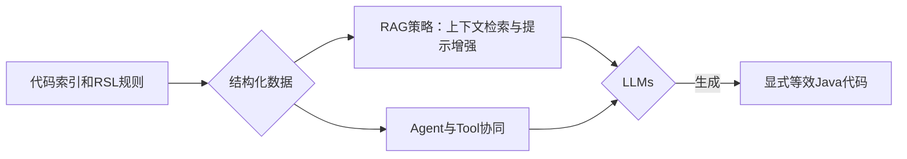
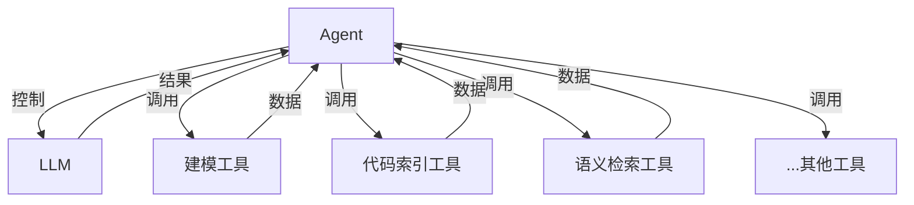
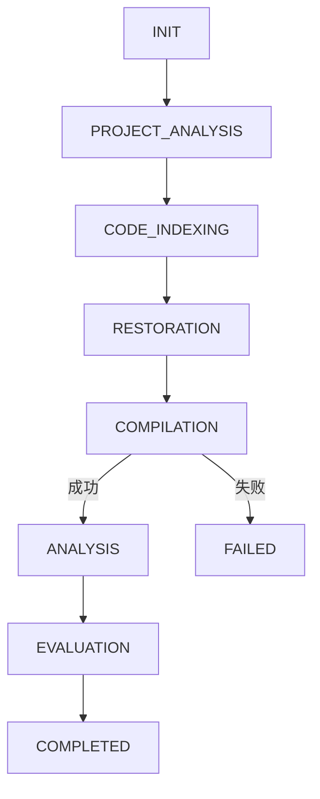
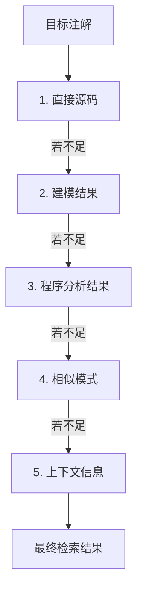

# 大语言模型驱动的Java注解语义还原方法

## 1. 引言

### 1.1 研究背景与问题概述

大型语言模型（LLMs）在代码理解与生成方面展现出强大潜力，为弥补传统静态分析方法的不足提供了新途径。尽管精确的注解语义建模（如先前工作中对Java注解的理解提升）为构建可靠的安全管理流程奠定了基础，但面对极端复杂的框架动态行为和深层隐式逻辑，单纯的静态规则系统仍有其局限性。

本项目在已有工作基础上，提出一种**大语言模型驱动的注解语义还原方法**。其核心目标是利用LLMs的理解与生成能力，将静态建模难以完美覆盖的、由注解驱动的复杂动态行为和隐式语义，还原为更易于分析的显式等效Java代码。此举旨在进一步提升分析的深度和准确性，为后续的智能化安全管理平台提供高质量的分析输入。

本方法通过代码索引和建模工具获取结构化数据，结合检索增强生成（RAG）策略和Agent工具链，实现对注解语义的精确还原。这种结构化数据驱动的方式不仅能够帮助大模型更好地理解代码上下文，还能有效避免大模型在处理大规模项目时的局限性。

### 1.2 目标与内容安排

本文档将详细介绍如何利用LLMs增强对注解的语义理解，并通过实验验证该方法的有效性。主要内容包括：
*   基础架构与关键概念
*   体系设计与工作流程
*   实验与评估

## 2. 基础架构与关键概念

### 2.1 语义还原的核心思路

**语义还原**是指将运行时的注解解析和动态代理逻辑转化为静态可分析的代码表示的过程。Java中的注解和框架通过反射、动态代理等机制实现灵活的功能扩展，但这些动态特性使得静态分析工具难以准确理解程序行为。

核心思路如图所示：


*图：注解语义还原的核心思路*

关键点：
1.  **结构化数据驱动**：利用代码索引和预定义的规则（如RSL规则）获取注解相关的结构化信息（元数据、依赖关系、切面规则等）。
2.  **检索增强生成（RAG）**：将结构化数据作为知识库，为LLM提供准确的上下文信息，避免生成不准确或不可行的代码。
3.  **工具链协同**：设计Agent和各类Tool，实现对LLM调用的精确控制，确保生成的代码符合静态分析的要求。

### 2.2 基于检索增强生成的上下文构建 (RAG)

RAG在本方案中承担知识库构建、上下文检索和提示增强的角色。

**知识库构建**：
```mermaid
graph TD
    A[源码解析] --> B[信息提取];
    B --> C[向量化 (CodeBERT)];
    C --> D[存储 (ChromaDB)];
```
*图：知识库构建流程*

知识库内容：
*   注解元信息（类型、属性值、目标元素）
*   Bean依赖关系（类间依赖、注入方式）
*   切面规则（AOP切点表达式、通知类型）
*   程序分析结果（IR、调用图CG、控制流图CFG）
*   上下文信息（代码注释、单元测试、相似代码片段）

系统使用CodeBERT对信息进行向量化处理，并存储在向量数据库ChromaDB中。

**上下文检索**：根据当前待还原的注解，从知识库中检索相关的背景信息（同类注解使用模式、相关框架配置、依赖的Bean定义等）。

**提示增强**：将检索到的结构化信息组织成提示词，指导LLM生成准确的还原代码。

### 2.3 Agent、Tool、Workflow 等组件

采用Agent-Tool架构，通过多个组件协同工作实现语义还原。

**Agent**：作为核心调度器，负责协调LLM调用和工具调用，维护多轮对话状态，决策下一步操作，并验证生成结果。


*图：Agent-Tool架构示意图*

**Tools (工具列表)**：

| 工具名称     | 功能描述             | 使用场景                 |
| :----------- | :------------------- | :----------------------- |
| 建模工具     | 构建代码的语义模型     | 分析注解语义和依赖关系     |
| 代码索引工具 | 建立代码元素索引       | 快速定位代码位置         |
| 语义检索工具 | 检索程序分析信息     | 获取程序语义信息         |
| 代码分析工具 | 构建程序分析图         | 提供程序语义信息         |
| 代码编译工具 | 编译和验证代码         | 确保代码可编译性         |
| 静态分析工具 | 执行静态分析           | 检测潜在问题             |
| 结果评估工具 | 评估还原质量           | 验证还原准确性           |

**Workflow**：定义了完整的处理流程，包括识别待还原的注解、检索相关上下文、生成候选方案、验证和优化，以及输出最终结果。

## 3. 体系设计与工作流程

### 3.1 基本概念与形式化定义

*   **工作流状态 (W)**: 枚举类型，表示系统当前所处的处理阶段 (INIT, PROJECT_ANALYSIS, CODE_INDEXING, RESTORATION, COMPILATION, ANALYSIS, EVALUATION, COMPLETED, FAILED)。
*   **项目状态 (S)**: 一个六元组 `(P, M, I, K, R, A)`
    *   `P`: 项目信息 (文件结构, 依赖关系, 构建配置)
    *   `M`: 建模结果 (注解元信息, Bean依赖, 切面规则)
    *   `I`: 代码索引 (类, 方法, 字段索引)
    *   `K`: 语义知识库 (IR, CFG, CG, 上下文信息)
    *   `R`: 还原结果 (生成的静态代码, 验证信息)
    *   `A`: 分析结果 (静态分析报告, 评估指标)
*   **状态转移函数 (δ)**: `δ: (W, S) → (W', S')`，定义了系统状态之间的转换规则。

### 3.2 系统工作流程

系统的工作流程通过状态转移函数驱动，如图所示：

*图：系统状态转移图*

**核心算法流程**:
1.  **初始化 (INIT)**: 系统启动，准备处理。
2.  **项目分析与建模 (PROJECT_ANALYSIS)**: 分析项目结构、依赖，构建代码语义模型 (调用T1: 建模工具)。
3.  **代码索引与知识库构建 (CODE_INDEXING)**: 建立代码元素索引 (调用T2: 代码索引工具)，构建程序分析图 (调用T4: 代码分析工具)，生成语义知识库。
4.  **语义还原 (RESTORATION)**:
    *   遍历需还原的代码文件。
    *   检索相关上下文信息 (调用T3: 语义检索工具)。
    *   构建提示词，调用LLM生成还原代码。
5.  **编译验证 (COMPILATION)**: 验证生成代码的可编译性 (调用T5: 代码编译工具)。若失败，可尝试修复或进入FAILED状态。
6.  **静态分析 (ANALYSIS)**: 对还原后的代码进行静态分析 (调用T6: 静态分析工具)。
7.  **结果评估 (EVALUATION)**: 评估还原质量 (调用T7: 结果评估工具)，生成报告。
8.  **完成 (COMPLETED)** 或 **失败 (FAILED)**。

### 3.3 检索与上下文构建

采用**层次化检索策略**，从直接到间接、从具体到抽象的顺序进行：
1.  **直接源码检索**: 注解定义、使用位置源码、相关类/方法/字段定义、注释文档。
2.  **建模结果检索**: 注解语义模型、Bean依赖关系、切面规则、框架配置。
3.  **程序分析结果检索**: IR、CFG、CG、依赖关系、数据流、指针分析结果。
4.  **相似模式检索**: 项目中相似注解使用模式、相关单元测试、框架API文档示例。
5.  **上下文信息检索**: 相关配置文件、环境变量、框架运行时行为、项目最佳实践。


*图：层次化检索策略*

该策略通过渐进式检索，保证效率和信息完整性。

### 3.4 语义还原与生成 (LLM交互)

通过精心设计的结构化提示词指导LLM生成等效的静态代码。

**提示词设计关键组成部分**：

1.  **系统角色提示词**: `你是一个专门用于Java代码语义还原的AI助手。你的任务是将使用注解的Java代码转换为不使用注解但保留等效功能的直接Java代码。`
2.  **任务背景提示词**: 解释为何需要语义还原（框架动态特性对静态分析的挑战）。
3.  **语义还原定义提示词**: 明确还原范围和方式（用直接Java代码近似表达注解功能，例如`@Autowired`转为`new`操作，AOP转为直接方法调用）。
4.  **最重要原则 - 代码可编译性提示词**: 强调生成的代码必须能编译通过，优先于精确语义还原。提供处理策略（使用`null`、临时变量、默认构造函数、修改访问修饰符、添加`try-catch`等）。
5.  **自主思考与判断提示词**: 指导模型在建模数据不完整或冲突时，基于自身Java知识和上下文进行合理推断和填补。
6.  **输入数据结构提示词**: 说明模型将接收的数据格式（文件路径、类名、源码、AOP和IoC相关的建模数据）。
7.  **还原规则提示词**: 详细说明各类注解的具体还原方法（例如，依赖注入：`@Autowired`根据IoC数据实例化，`@Value`直接赋值；AOP切面：分析切点和通知，在目标方法适当位置添加通知方法的显式调用）。
8.  **输出要求提示词**: 规范生成代码的格式和质量标准（保证编译、最小改动、保留注释、添加还原说明注释、不修改原有逻辑、直接输出修改后源码）。
9.  **处理流程提示词**: 提供从分析注解到整合生成代码的完整步骤。

**动态提示词构建**: 根据检索到的上下文信息（源码、元数据、建模数据、相关示例）动态选择和组装提示词模板。

### 3.5 代理与工具调用 (Agent)

Agent作为核心调度器，通过状态转移函数协调整个工作流程，处理依赖关系、错误恢复和并行处理。

**Agent状态转移表 (简例)**：

| 当前状态         | 触发事件       | 执行动作 (工具)              | 下一状态         |
| :--------------- | :------------- | :--------------------------- | :--------------- |
| INIT (S0)        | 项目加载       | T2: 扫描项目结构             | PROJECT_ANALYSIS (S1) |
| PROJECT_ANALYSIS (S1) | 分析完成       | T1: 构建语义模型             | CODE_INDEXING (S2) |
| ...              | ...            | ...                          | ...              |
| COMPILATION (S4) | 编译失败       | T5: 修复错误/回滚           | COMPILATION (S4) / FAILED (S8) |
| ...              | ...            | ...                          | ...              |
| EVALUATION (S6)  | 评估完成       | T7: 生成报告                 | COMPLETED (S7)   |

Agent通过状态转换、错误处理、重试机制和状态回滚等机制，自动化处理整个语义还原流程。

## 4. 实验与评估

### 4.1 实验设置

*   **测试集**: `annotated-benchmark`，包含多种典型Java框架（Spring, MyBatis）注解使用场景和多种安全漏洞（路径遍历、命令注入、SQL注入）。
    *   36个Java源文件，约5570行代码。
    *   MVC分层架构，包含controller, service, mapper等8个关键包。
    *   每种漏洞类型均包含安全与不安全的实现。
*   **漏洞构造**: 利用框架特性构造，如MyBatis的`${}`拼接、Spring依赖注入传递不安全参数等。
*   **实验环境**:
    *   硬件: AMD Ryzen 7 5800H, NVIDIA RTX 3060 Laptop, 64GB RAM
    *   软件: Arch Linux, JDK 17, Python 3.10, Soot 4.3.0, FlowDroid 2.10
    *   LLMs: GPT-4o, DeepSeek-R1, Claude-3.7 Sonnet
*   **基准方法**: 直接使用污点分析工具（基于Soot和FlowDroid）分析原始代码。
*   **提出方法**: 先进行语义还原，再使用相同污点分析工具分析还原后的代码。

### 4.2 评估指标

*   **基本统计量**: TP, FP, TN, FN
*   **派生指标**: Precision, Recall, F1-Score, Accuracy

### 4.3 效果评估：准确度

**语义还原前后检测效果对比**:

| CWE        | 指标      | 基准方法 | 语义还原后 |
| :--------- | :-------- | :------- | :--------- |
| CWE-22     | Precision | 0.70     | **1.00**   |
| (路径遍历) | Recall    | 0.70     | **1.00**   |
|            | F1        | 0.70     | **1.00**   |
| CWE-78     | Precision | 0.57     | **0.56**   |
| (命令注入) | Recall    | 0.80     | **1.00**   |
|            | F1        | 0.67     | **0.71**   |
| CWE-89     | Precision | 0.00     | **1.00**   |
| (SQL注入)  | Recall    | 0.00     | **0.76**   |
|            | F1        | 0.00     | **0.86**   |
| **总体**   | Precision | 0.63     | **0.82**   |
|            | Recall    | 0.37     | **0.88**   |
|            | F1        | 0.48     | **0.85**   |

**结论**: 语义还原技术全面且显著提升了漏洞检测效果。
*   总体TP增长140%，FN减少80.8%，Recall增长137.8%，F1增长77%。
*   对SQL注入（CWE-89）检测效果提升尤为显著，召回率从0提升至0.76。
*   路径遍历（CWE-22）在提高检出率的同时消除了误报。

**不同大模型的性能对比**:
*   Claude-3.7 Sonnet首次编译成功率略高。
*   GPT-4o平均响应速度略优。
*   DeepSeek-R1能进行更复杂推理但可能不完全遵循指令。
*   三种模型还原代码在静态分析工具评测结果上无显著差异。

**处理时间对比 (秒)**:

| 处理阶段             | DeepSeek-R1 | Claude-3.7 Sonnet | GPT-4o   |
| :------------------- | :---------- | :---------------- | :------- |
| ...                  | ...         | ...               | ...      |
| **语义还原**         | **839.77**  | **382.52**        | **270.64** |
| ...                  | ...         | ...               | ...      |
| **总计**             | **859.77**  | **403.01**        | **291.50** |

### 4.4 案例分析与局限性

**成功案例关键因素**:
*   **依赖注入还原**: 明确的类型信息、简单的依赖关系、充分的上下文。
*   **MyBatis SQL注解还原**: LLM的SQL解析能力、参数映射、结果对象构建、资源管理、接口`default`方法实现。
*   **AOP切面还原**: 切点表达式解析、通知逻辑精确插入、参数传递、全局影响分析。

**局限性分析**:
1.  **复杂动态依赖解析**: 多层嵌套、循环或条件依赖（如`@Conditional`）场景下准确性下降。LLM难以确定运行时具体注入。
2.  **反射和动态代理**: 大量使用反射、动态代理、动态类加载的代码，LLM无法准确推断所有可能的调用路径和数据流。
3.  **环境依赖性**: 依赖特定环境变量、系统属性或外部服务的代码，LLM在无完整环境信息时只能提供默认值。
4.  **框架特定行为**: 某些高度抽象的框架机制（如Spring Data JPA根据方法名动态生成查询）超出LLM理解范围。

## 5. 总结

本方法通过深度融合代码索引、预构建的语义模型以及LLMs的代码理解与生成能力，实现了将复杂的、由注解驱动的动态行为和隐式语义有效转换为更易于分析的显式等效Java代码。基于RAG和Agent-Tool协同的框架，通过层次化检索、动态提示词构建及结构化Agent工作流程，确保了LLMs在充分理解代码上下文和注解精确语义的基础上进行高质量代码还原。

实验证明，该方法能显著提升后续静态分析工具的漏洞检出率，生成的代码兼具可编译性、可读性和可维护性。它为后续更高级的智能化安全分析（如误报二次识别、上下文感知修复建议）提供了关键技术支撑，是连接精确静态分析与高级智能管理的桥梁。

尽管存在局限性，但其在主流框架常见注解场景中的优异表现，证明了其应用价值和发展潜力。